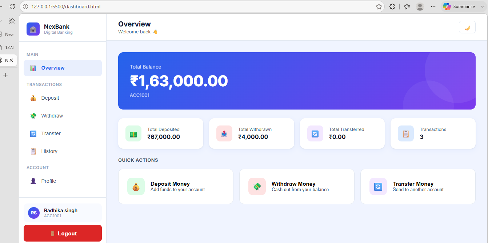
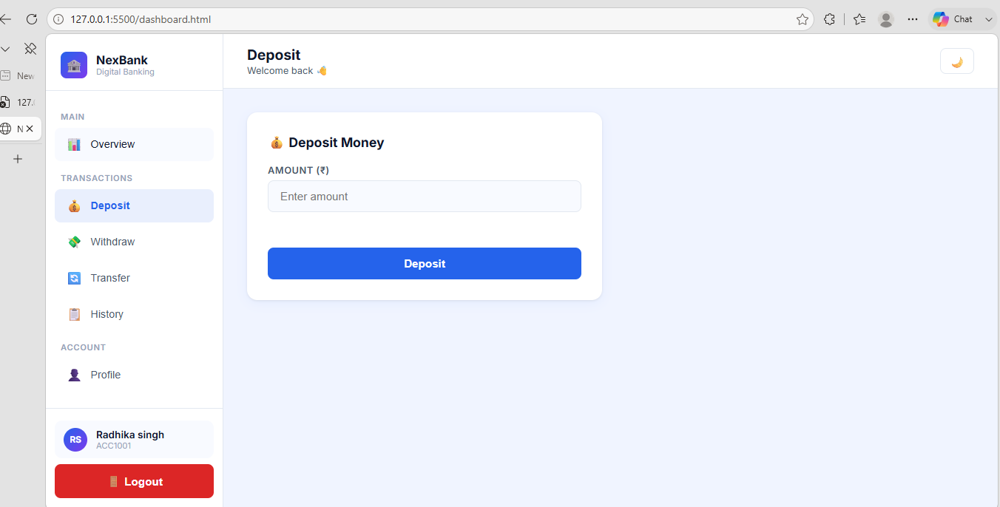
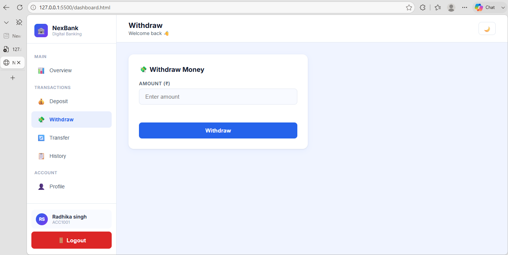
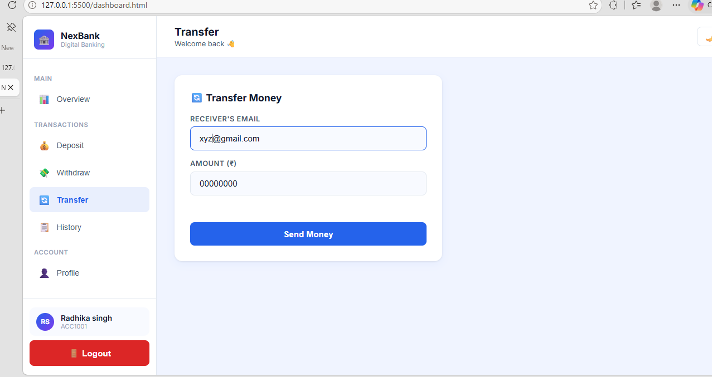
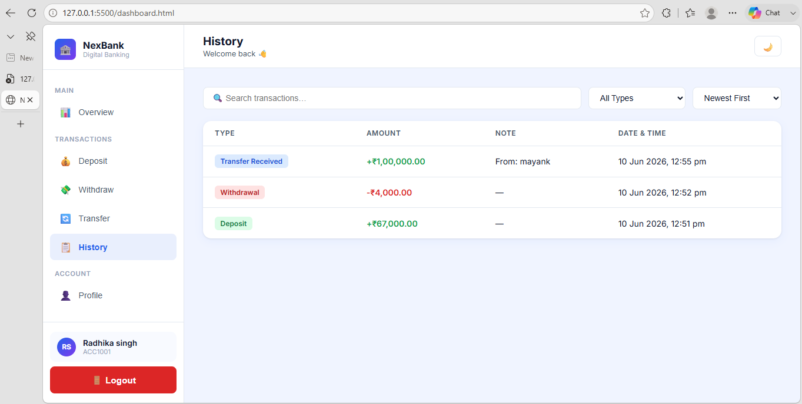
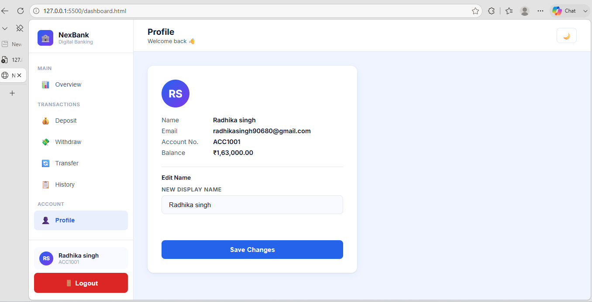

# Bank-Management-System

A frontend banking web application built with HTML, CSS, and Vanilla JavaScript. Simulates core banking operations like deposits, withdrawals, and transfers, with all data persisted using the browser's localStorage API.

## Features

- **User Authentication** — Register and login with form validation
- **Dashboard** — Real-time balance display with account overview and stats
- **Deposit Money** — Add funds to account balance
- **Withdraw Money** — Withdraw funds with insufficient balance check
- **Transfer Money** — Send money to another registered user via email
- **Transaction History** — View all transactions with search, filter, and sort options
- **User Profile** — View account details and edit display name
- **Dark Mode** — Toggle between light and dark themes
- **Auto-generated Account Numbers** — Unique account number assigned on registration
- **Responsive Design** — Works across desktop, tablet, and mobile screens
- **Data Persistence** — All data stored in localStorage, retained across sessions

## Tech Stack

- **HTML5** — Page structure
- **CSS3** — Styling, responsive layout, dark mode theming
- **JavaScript (Vanilla)** — Application logic, DOM manipulation
- **localStorage API** — Client-side data storage

## Screenshots

### Login Page


### Dashboard


### Deposit


### Withdrawal


### Transfer Money


### Transaction History


### Profile Section


## Project Structure
BankManagementSystem/
│
├── index.html          # Login page
├── register.html       # Register page
├── dashboard.html       # Dashboard (overview, deposit, withdraw, transfer, history, profile)
│
├── css/
│   └── style.css        # All styling
│
├── js/
│   ├── storage.js       # localStorage utility functions
│   ├── auth.js          # Login & registration logic
│   ├── transaction.js   # Deposit, withdraw & transfer logic
│   └── dashboard.js      # Dashboard UI, navigation & dark mode logic
│
└── outputSS/             # Screenshots

## How It Works

- On registration, a new user object is created and stored inside a `users` array in localStorage.
- On login, credentials are matched against the `users` array and the matched user is stored as `currentUser`.
- Every transaction (deposit/withdraw/transfer) updates the `currentUser` balance and pushes a record into that user's `transactions` array, then syncs the change back to the `users` array in localStorage.
- The dashboard is protected — if no `currentUser` is found, the user is redirected to the login page.

## How to Run

1. Clone the repository
```bash
   git clone https://github.com/Radhikasingh28/Bank-Management-System.git
```
2. Open the folder in VS Code
3. Install the **Live Server** extension (if not already installed)
4. Right-click `index.html` → **Open with Live Server**

No build steps, no dependencies — runs directly in the browser.

## Future Scope

This project is structured to be backend-ready. The localStorage calls (`getItem`/`setItem`) can be directly replaced with API calls (`fetch`) once a backend is integrated using:
- **Node.js + Express** — Server and REST API
- **MongoDB** — Database for users and transactions
- **JWT** — Authentication
